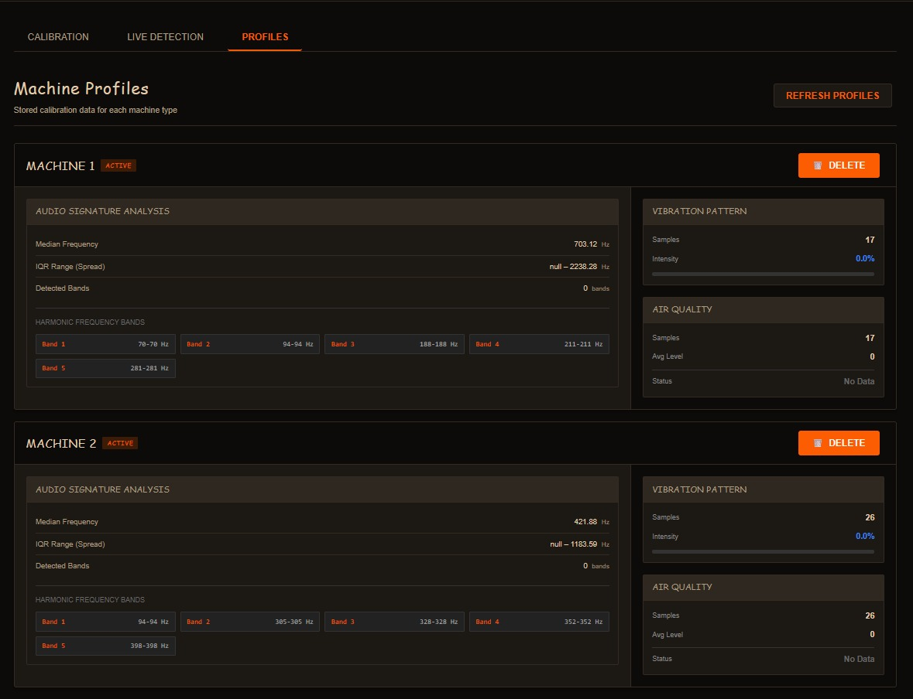
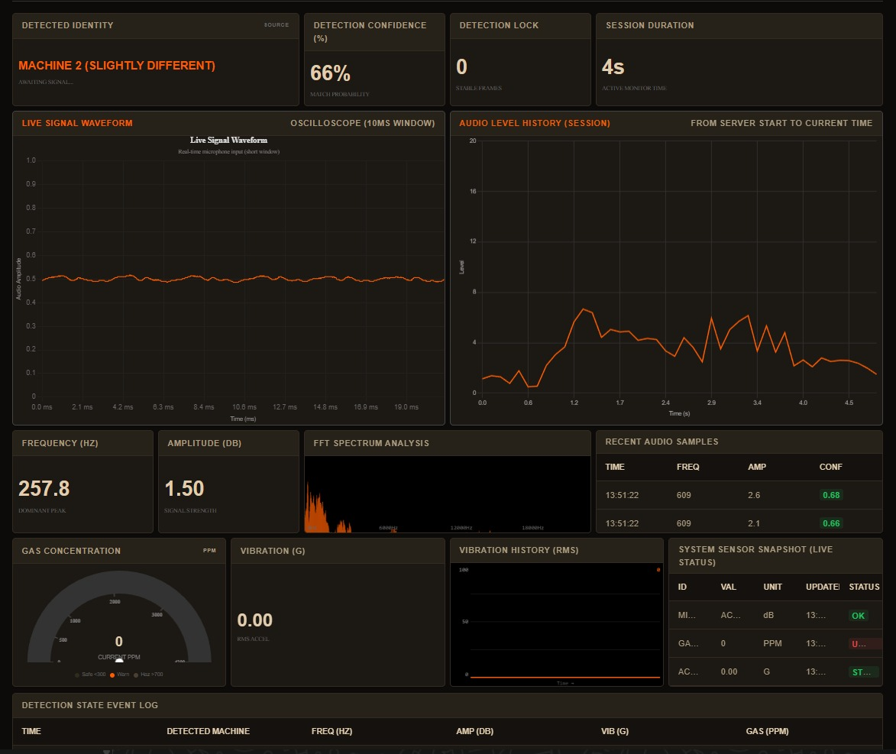
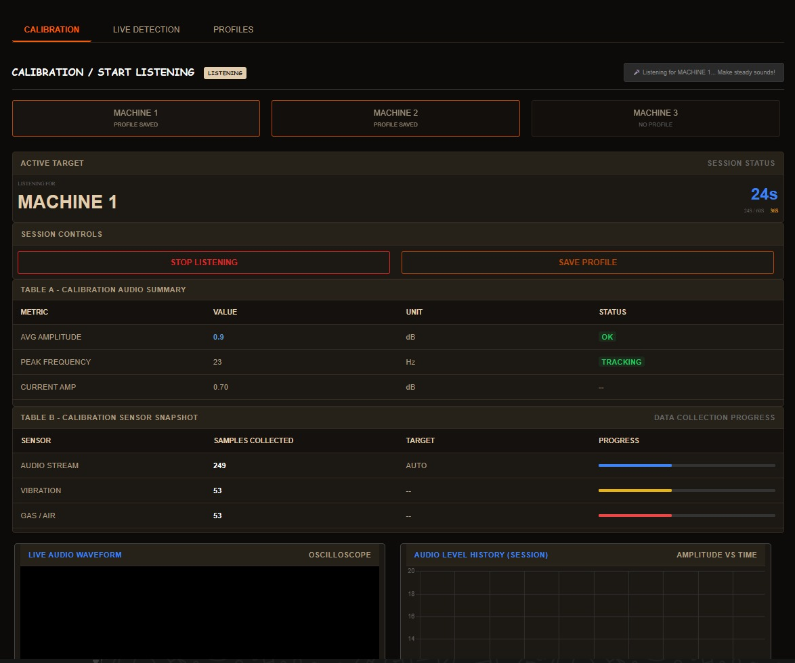
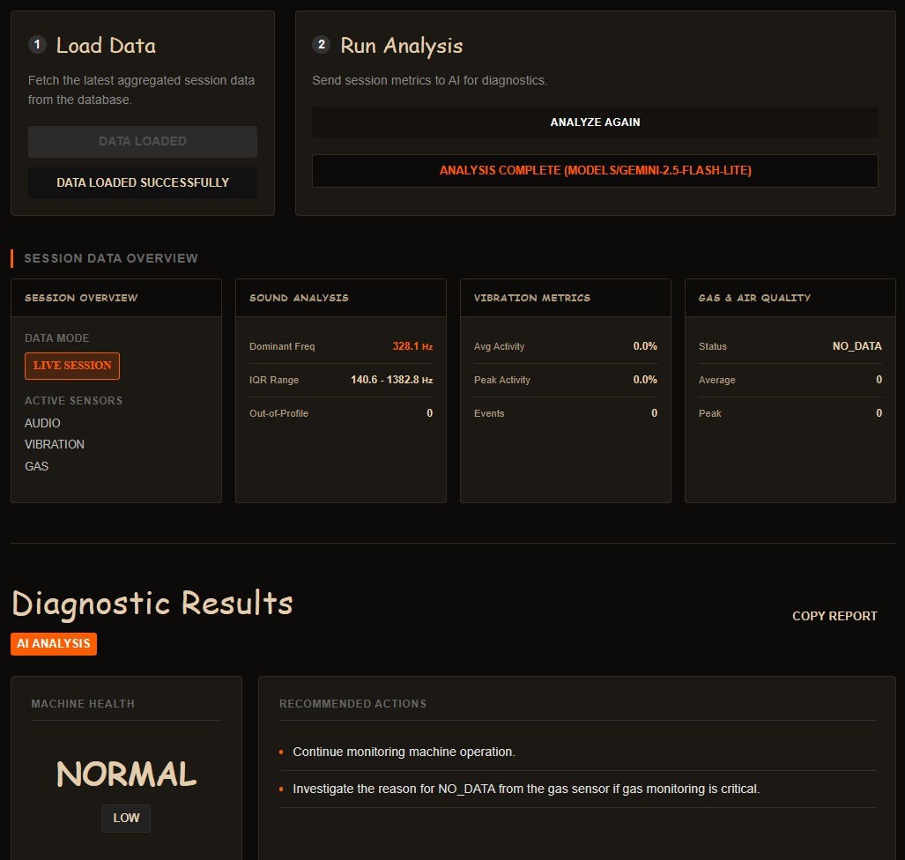

# FSociety: Multi-Machine Sound Detection System

**FSociety** is a browser-based machine sound monitoring system that simultaneously detects 3+ machines running together by analyzing their unique frequency signatures using FFT (Fast Fourier Transform).

## 🎯 Overview

The system allows you to:
1. **Calibrate** individual machines to learn their sound signatures.
2. **Detect** which machines are running in real-time, even when multiple are operating simultaneously.
3. **Monitor** history and performance via a dashboard.

---

## 📸 System Screenshots

<p align="center">
  
  
</p>
<p align="center">
  
  
</p>

---

## 🚀 Quick Start

### 1. Prerequisites
- **Python 3.8+**
- **PostgreSQL** installed and running locally.
- **Microphone** access for the browser.

### 2. Setup Database
Ensure PostgreSQL is running. The system requires a database named `soundml`.
Update your `.env` file or `app/db.py` with your credentials if they differ from default.

### 3. Install Dependencies
```powershell
pip install -r requirements.txt
```

### 4. Start Server
```powershell
python run.py
```
→ Opens on http://127.0.0.1:5000

---

## 🎮 Usage Guide

### 1. Calibrate Machine (60 seconds)
1. Go to **Calibration Tab**.
2. Select a machine name (or create new).
3. Click **"Start Recording"** and run the machine steadily for 60 seconds.
4. Click **"Save Profile"**.

### 2. Detect Live
1. Go to **Detection Tab**.
2. Click **"Start Listening"**.
3. Run machines in any combination.
4. The UI will display: `🎵 MACHINE_1 + MACHINE_2`

---

## 📂 Project Structure

Verified layout of the application:

```text
FSociety/
├── app/                  # Main Application logic
│   ├── routes/           # API and Page routes
│   ├── scripts/          # Helper scripts
│   ├── services/         # Business logic (Audio processing, DB)
│   ├── static/           # CSS, JS, Images for UI
│   └── templates/        # HTML Templates
├── data/                 # Data storage
├── docs/                 # Documentation files
├── images/               # Screenshot assets
├── run.py                # Application Entry Point
└── requirements.txt      # Python Dependencies
```

---

## 📋 Features

- **Multi-Machine Detection**: Identifies up to 4-5 machines running simultaneously.
- **Robustness**: Uses IQR-based statistical profiling to handle minor frequency drifts.
- **Real-time**: ~500ms latency for detection.
- **Persistence**: PostgreSQL backend for storing machine profiles and user data.

---

## 🛠️ Troubleshooting

### Server won't start
**Error:** `Can't connect to PostgreSQL`
**Fix:** 
1. Ensure PostgreSQL service is running.
2. Verify credentials in `app/db.py`.
3. Create the database: `CREATE DATABASE soundml;`

### Microphone permission denied
**Fix:** Allow microphone access in your browser settings for `127.0.0.1`.

### Wrong machine detected
**Fix:** Ensure machines have at least 40Hz frequency separation. Recalibrate if the machine's operating speed has changed.
